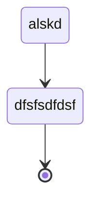
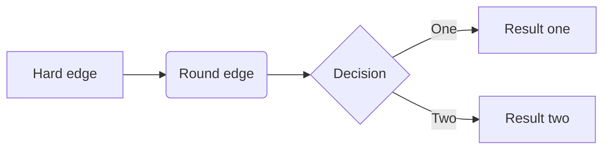
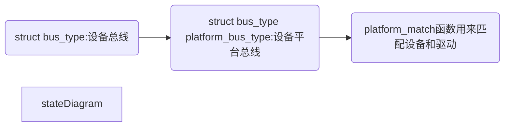

```mermaid
stateDiagram
alskd --> dfsfsdfdsf 
dfsfsdfdsf --> [*]
```

```mermaid
graph LR
A[Hard edge] -->B(Round edge)
    B --> C{Decision}
    C -->|One| D[Result one]
    C -->|Two| E[Result two]
```

```mermaid
graph LR
A(struct bus_type:设备总线) --> B(struct bus_type platform_bus_type:设备平台总线)
B-->C(platform_match函数用来匹配设备和驱动)

stateDiagram
```

