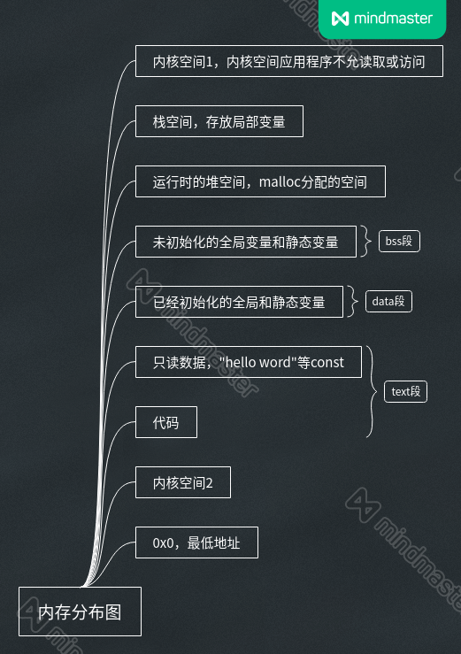

# C语言内存

## 指针基础

### 指针修饰符
#### const    常量，只读，不能变

- const char *p = char const *p,

    p is a pointer to const char

    p可任意指向，但指向的内容不允许修改，类似于字符串“hello world!”

- char * const p = char *p const

    const p is a pointer to char

    p指向的位置固定，内容可变，一般为硬件资源，寄存器地址等

- const char * const p

    const p is a pointer to const char

    指向内容和位置都不许变,一般为ROM设备

## 数组

原理：另外一种对内存的操作方式，本质上跟指针是一样的

- int a[100]

a是个常量标签，不是指针，出现a = xxx时是错误的，a++也错（相当于a+=1）
### 初始化
#### int a[10] = 空间 
#### C语言{}的意义
- **C语言默认使用{}来表示空间，即看到{}要想到一整块的空间操作**
- int a[10] = {10,20,30}	//此步骤只是方便程序员操作，实际执行相当于逐一依次赋值,程序执行效率不变

#### char buf[10] = {'a','b','c'}	普通数组用法
此处涉及到字符串和数组，一定注意
- **字符串和数组重要区别：尾部有一个'\0'**

#### char buf[10] = {"abc"}	字符串用法
- “”作用是自动在abc末尾加上‘\0'

#### char buf[10] = "abc"
是上一种{"abc"}写法的简化版，等效

#### char buf[10] = "abc"与char *p = "abc"区别
- char *p = "abc"
原理：指针p指向了“abc”对应的地址
- char buf[10] = "abc"
原理：将“abc”的值依次赋值给buf[0],buf[1],buf[2]...而"abc"另外存在了与buf不同的位置
因此：若出若出现以下情况
p[2] = 'e'	错误，p指向的是const常量"abc"
buf[2] = 'e'	正确，buf就是个普通数组，可随意变

#### char buf[] = "abc"与以上带buf[10]的区别
带10数组固定分配10个值，不带编译器自动为数组分配值数量等于“abc”需要数量，此处为4个

### 初始化完后二次赋值
#### 分为字符空间和非字符空间拷贝
- 字符空间：使用ascii码来解码的空间-->给人看的空间，\0作为结束标志
- 非字符空间：解析成具体的数值
二者定义的时候养成习惯：
char buf[10];-->string
unsigned char buf[10];-->data

#### 字符空间拷贝原则
一块空间，当成字符空间时，C语言提供了一套字符拷贝函数
字符拷贝函数的原则：内存空间间的逐一赋值，一旦出现0，函数就即将结束

#### strcpy()
最基本的字符拷贝函数，使用时注意内存泄露问题，此函数看到0才结束

#### 非字符空间拷贝原则
三个：
src： source源地址
dest：destination目的地址
num：number拷贝个数

#### memcpy()
```c
void *memcpy(void *dest, const void *src, size_t n);//字符拷贝函数，以下是使用范例

int buf[10];
int sensor[100];
memcpy(buf, sensor, 10*sizeof(int));//n表示byte,故需要计算字节数目
//此处不使用strcpy或strnpy是因为这两个都会识别0为字符串结束标志，所以拷贝会出问题


```
### 指针数组char *a[100]
本质是数组里面存放了指针
int a[100]--->int 修饰a里面的每个值的类型a[0],a[1]...
char *a [100]--->char 修饰a[0],a[1]...里存放的指针指向内容的属性，即指向char类型的值对应地址
以上两个a，sizeof(a) = 100 * 4 

#### 指针数组和二维指针的关系 char **a
本质上是一样的，都是指向指针的指针
char **a 是一个指向指针的指针
char *a[100]是100个指向指针的指针

### 指针和数组原理性知识总结
#### 定义指针，分别表示 int a[10],int b[5][6]首地址
```c
int a[10];
int b[5][6];
int *p1 = a;	//正确
int **p2 = b;	//错误
int (*p)[6] = b;	//正确

```
#### C语言编译器本质是字符解释器，定义变量是基于变量名优先从右边解释
##### int a[10]
变量名a，往右[]，a即被解释为一个数组名，即成为了一个标签，具有数组的性质(有空查一下a怎么保存的)，此时数组a已经有名字，长度，右边没东西，往左看，有int，即为数组里面每个之对应的保存方式：int类型
即：数组三要素：名字，长度，组内每个值的保存方式（长度）

##### int *a
变量名a，往右没有，往左有*，表示a是个指针，具有指针性质，在往左，有int，表示从a对应的地址读取方式为int
即：指针三要素：名字，长度，读取方式（一次读几个字节）
指针和数组三要素几乎等价

##### int *a[10]
变量名a，往右[]，a即为一个数组，具有数组性质，想象三要素，还差组内每个值的保存方式，再往右没有值，往左，有*，表示组内每个值保存方式为指针，此时要想到指针的三要素，指针名字为a[0],a[1]...每个指针的读取方式还没确定，再往左看，有int，即为指针指向的值的读取方式
即：a是一个数组，数组内每个值是个指针，每个指针指向内容读取方式为int

##### int **a
变量名a，右边没有东西，左侧第一个*，表示a是个指针，三要素还差读取方式，再左侧，*，表示读取方式为指针类型，该指针类型三要素还差读取方式，再往左侧，int，表示这个指针读取方式为int类型
即：a表示一个指针，指向一个存放指针变量的位置，存放的指针变量指向一个存放int类型的地址

##### int (*p)[10]
变量名p，有括号先看括号里的，*表示p是个指针，还差指向内容的读取方式，看右边，[],表示指针类型的读取方式是数组，此数组长度是10，此数组还差每个值的保存方式没有确定，此时看左侧，int，表示数组每个值保存为int类型
即：p表示一个指向数组的指针，该数组10个值，每个值保存一个int

#### 解释：始终记住指针和数组的本质
指针和数组都是用来处理内存操作的不同方式
声明时指针和数组都有三要素，见上面变量定义时的解释
##### 指针是否够表示数组名判断技巧
例如：
```c
int a[10];
int b[5][6];
int *p1 = a;	//p1+1,跨过一个int；a+1(a[1])，跨过一个int；故可用p1表示a
int **p2 = b;	//p2+1，跨过一个指针变量；b+1(b[1][6]),跨过6个int，故不可表示
int (*p)[6] = b;	//p+1,跨过6个int，b+1(b[1][6])，跨过6个int，故可表示

```

## 结构体
见onenote结构体部分笔记和[[C#结构体对齐大小问题]]

## 内存分布图
实际上是C语言中常用的几个section（段，程序或者变量存放的位置）
