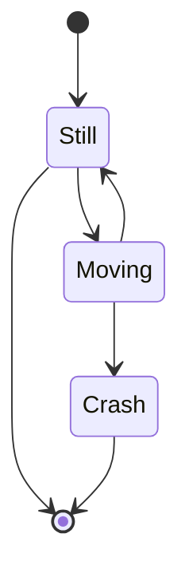
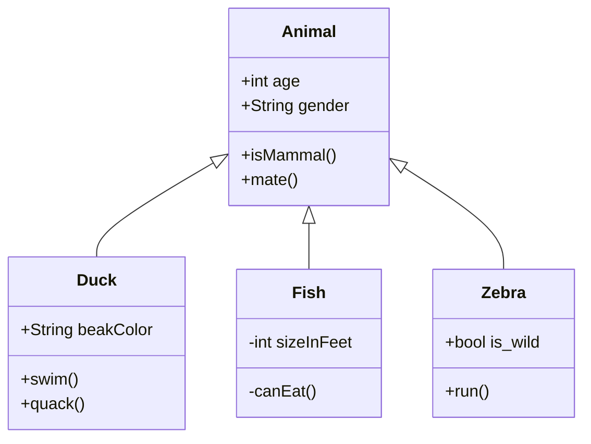
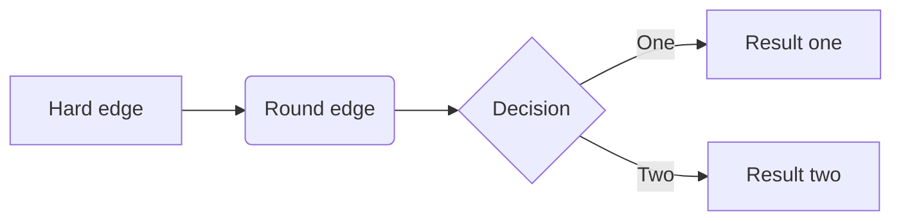
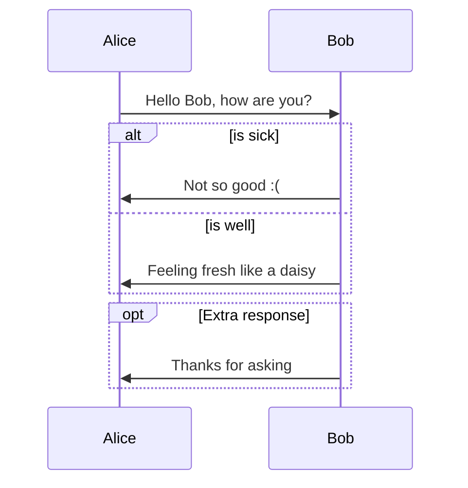

[TOC]
# 这是一个md文件
## 这是一个副标题
### 这是一个三级标题
```
void main(void)
{

dddddd
}
```
## markdown段落格式

这是markdown普通段落

*斜体文字*

**粗体文字**

***加粗斜体文字***

~~这是删除体~~

==高亮==

## markdown引用内容

>这是被引用内容
>>嵌套使用引用内容
>>
>>>更深一层嵌套使用引用内容

## markdown列表
### 有序列表
1. 选项1
2. 选项2
3. 选项3
4. ...
### 无序列表
- 选项1

- 选项2
- ...
### 有序无序嵌套

### 使用
1. 选项1
    - 选项11
    - 选项12
2. 选项2
## markdown分隔号
***
## markdown链接
### 普通链接
[要显示的文字](http://....)

点击此处访问：  [bilibili](http://...)
### 图片链接


## markdown代办清单

???
## markdown代码块
### 四个空格代表本行为代码
### ～～～标记代码段
~~~C
int led_init()
{
    return 0;
}
~~~
## markdown注脚
## markdown目录

要访问的地址为：[bilibili](https://www.bilibili.com)

## 下划线

下划<u>线</u> Ctrl+u


## 流程图
### State Diagrams（状态图）

### Class Diagrams（类图）



### Flowcharts（流程图）
```flow
st=>start: Start
op=>operation: Your Operation
cond=>condition: Yes or No?
e=>end

st->op->cond
cond(yes)->e
cond(no)->op
```



### Sequence Diagrams(顺序图)
```sequence
Alice->Bob: Hello Bob, how are you?
Note right of Bob: Bob thinks
Bob-->Alice: I am good thanks!
```
