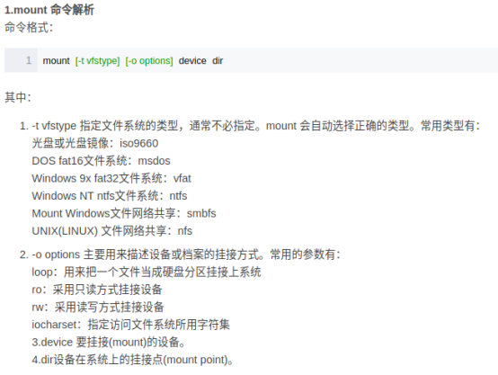
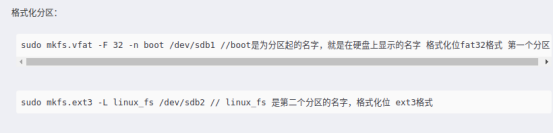
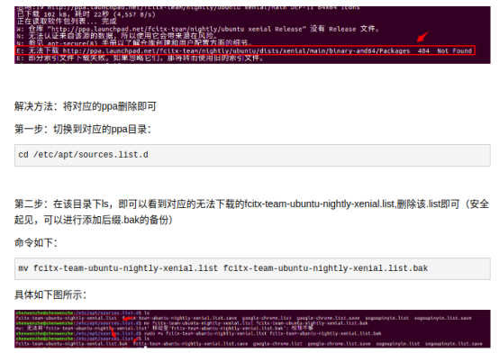
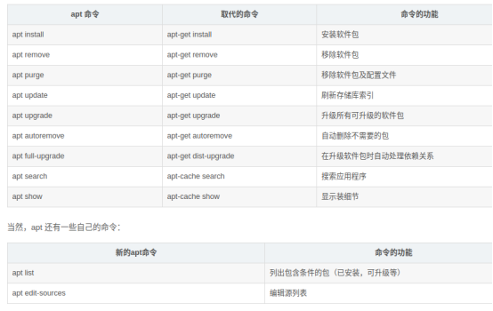

## Ubuntu系统安装
1. 如果系统设置为GPT+UEFI模式，则不用设置/boot分区，直接设置EFI分区512M即可
2. 其他分区：
/: --系统根目录，一定要有，可以只有这个，其他都不要，类似于C盘
/swap: --交换分区，一般为电脑内存一半大小，内存不够用了可以使用，此分区是否要看个人需求
/home:	/usr: --个人文件存放位置，软件存放位置，分区则用，不分区自动在/:分区下生成相应目录，分区好处是系统崩了重装系统的话个人文件软件不会被清除
3. 启动管理器
Windows下：Windows boot manager
Ubuntu下： ubuntu….

## 磁盘挂载相关:
注意：以下说的挂载是指挂载的磁盘分区，如/dev/sdb为sd卡，不是分区，不可挂载，
/dev/sdb1为sd卡的分区之一，就可以挂载
单独的mount命令可查看磁盘挂载点
单独的df命令可查看磁盘分区使用情况和挂载点
使用fdisk-l可最详细的查看系统磁盘信息，包括已分区未分区，但没有挂载信息
以上三者查看磁盘方式可以交替使用
一个磁盘空间可以使用挂载命令挂载许多次，但取消挂载时也要原路返回许多次，类似于入栈出栈，sd卡刚插入的时候默认挂载到media文件夹下，使用umount命令卸载之后使用df或者mount命令就看不到sd卡挂载信息了，取消挂载信息后就可以进行格式化，分区等操作。

使用fdisk对磁盘分区进行增删，分完区用mkfs进行格式化
对于SD卡，命令sudo fdisk /dev/sdb可进入fdisk设置界面，通过指示输入不同命令可完成对SD卡的分区，显示详细信息，分区type设置，可设置分区大小，分区完成后使用mkfs进行格式化
此处分区type和格式化的文件类型似乎关系不大，所以关注格式化时设置的文件类型，一般使用vfat格式化，即使用下图中的第一行

格式化完成即可使用mount或者umount进行挂载卸载

## 解决sudo apt-get update命令执行问题:
/etc/apt/sources.list文件里保存了apt-get update对应的源，该命令为参考sources.list中的源更新本地软件库，比如增加新的源，就需要update一下来同步，才能进行安装对应软件，不同步就找不到软件

## Ubuntu查看文件夹内存大小：
在文件夹中输du -sh可查看文件夹所占内存

## Ubuntu下常用解压命令：
tar -vxjf uboot-imx-2016.03-2.1.0-g8b546e4.tar.bz2

## U盘拷贝时sync同步
Ubuntu往U盘考文件不显示进度，系统会每隔一段时间同步缓冲区的文件，所以，以防万一，需要在命令行输入sync完成同步
Sync：即synchronize 使同步

## 全局搜索命令：
使用命令grep -nR "87800000"可以在uboot目录下递归搜索含有87800000的文件
可使用“find -name 文件名 ”命令搜索目录下的文件

## Ubuntu下查看正在运行的软件cpu内存：
top命令
q退出，P按照CPU资源大小排序，M按照内存大小排序

## Ubuntu下安装flathub下的软件
Ubuntu20.04已经安装好flatpak，若需要用到flathub下的软件可以查一下怎么安装，具体有些特定的软件可能需要在flathub下才能安装，也可能flathub下有更丰富的linux软件