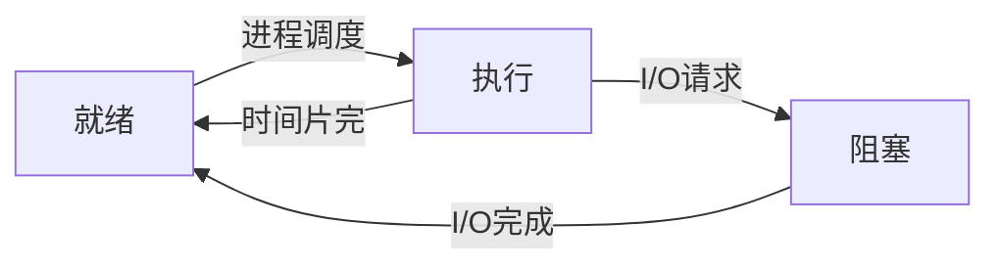

## 文件编程
linux man手册相关
man1：linux命令:ls,cd ...
man2:系统调用
man3：C库函数

两种方法：

- Linux系统调用，依赖于linux系统
- C语言库函数，各平台都可以进行

### 系统调用方式：

`int creat(const char *filename, mode_t mode)`创建一个文件

open打开一个文件，read，write，
open函数需注意
函数原型:
```int open(const char *pathname,int flags,int perms)```
参数：
pathname:被打开的文件名（可包括路径名如"dev/ttyS0"）
flags:文件打开方式,
O_RDONLY:以只读方式打开文件
O_WRONLY:以只写方式打开文件
O_RDWR:以读写方式打开文件
O_CREAT:如果改文件不存在，就创建一个新的文件，并用第三个参数为其设置权限
O_EXCL:如果使用O_CREAT时文件存在，则返回错误消息。这一参数可测试文件是否存在。此时open是原子操作，防止多个进程同时创建同一个文件
O_NOCTTY:使用本参数时，若文件为终端，那么该终端不会成为调用open()的那个进程的控制终端
O_TRUNC:若文件已经存在，那么会删除文件中的全部原有数据，并且设置文件大小为0
O_APPEND:以添加方式打开文件，在打开文件的同时，文件指针指向文件的末尾，即将写入的数据添加到文件的末尾
O_NONBLOCK: 如果pathname指的是一个FIFO、一个块特殊文件或一个字符特殊文件，则此选择项为此文件的本次打开操作和后续的I/O操作设置非阻塞方式。
O_SYNC:使每次write都等到物理I/O操作完成。
O_RSYNC:read 等待所有写入同一区域的写操作完成后再进行
在open()函数中，falgs参数可以通过“|”组合构成，但前3个标准常量（O_RDONLY，O_WRONLY，和O_RDWR）不能互相组合。
perms:被打开文件的存取权限，可以用两种方法表示，可以用一组宏定义：S_I(R/W/X)(USR/GRP/OTH),其中R/W/X表示读写执行权限，USR/GRP/OTH分别表示文件的所有者/文件所属组/其他用户,如S_IRUUR|S_IWUUR|S_IXUUR,（-rex------）,也可用八进制表示同样的权限0777

返回值：
成功：返回文件描述符
失败：返回-1

```c
// if ((to_fd = open(argv[2], O_CREAT, 0777)) == -1)  //使用此方式后续打开文件无法写入
   if ((to_fd = open(argv[2], O_RDWR|O_CREAT, 0777)) == -1) //使用此方法后续文件可以写入
   open函数第二个参数为O_CREAT时第三个参数有效，为设置的权限
   
   bytes_write = write(to_fd, ptr, bytes_read)	//后续write写入，失败返回-1
```

lseek移动文件读写指针，读写操作都是从该指针指向的位置开始，且会改变该指针位置

access判断文件是否可读可写等

### 库函数方式：

fopen:打开文件
fread，读文件
fwrite，写n个字段到文件
fgetc，读一个字符
fputc，写入一个字符
fscanf，格式化输出文件的内容 
fprintf，格式化输入到文件中
fseek，类似于lseek
getcwd，获取当前路径
mkdir，创建一个目录

## 时间编程

时间类型：

- 格林威治时间（GMT）即世界标准时间
- 日历时间，即从一个标准时间点（如：1970年1月1日0点）到现在经过的秒数来表示的时间

### 时间获取

time_t time():获取日历时间

gmtime();将日历时间转化为格林威治时间，保存到tm结构体

localtime():将日历时间转化为本地时间，保存到tm结构体

asctime()，将tm结构体内保存的时间值转化为字符串

ctime()，将日历时间转化为本地时间字符串形式

gettimeofday()，计算一天内凌晨到现在的时间差

sleep()，使程序睡眠多少s
usleep()，使程序睡眠多少us
```c
struct tm
{
  int tm_sec;			/* Seconds.	[0-60] (1 leap second) */
  int tm_min;			/* Minutes.	[0-59] */
  int tm_hour;			/* Hours.	[0-23] */
  int tm_mday;			/* Day.		[1-31] */
  int tm_mon;			/* Month.	[0-11] */
  int tm_year;			/* Year	- 1900.  */
  int tm_wday;			/* Day of week.	[0-6] */
  int tm_yday;			/* Days in year.[0-365]	*/
  int tm_isdst;			/* DST.		[-1/0/1]*/

# ifdef	__USE_MISC
  long int tm_gmtoff;		/* Seconds east of UTC.  */
  const char *tm_zone;		/* Timezone abbreviation.  */
# else
  long int __tm_gmtoff;		/* Seconds east of UTC.  */
  const char *__tm_zone;	/* Timezone abbreviation.  */
# endif
};
```

```c
#include <stdio.h>
#include <time.h>

int main(void)
{
    struct tm *local;
    time_t t;
    t = time(NULL);
    local = localtime(&t);
    printf("local hour is: %d\n", local->tm_hour);
    local = gmtime(&t);
    printf("UTC hour is: %d\n", local->tm_hour);
    return 0;
}
```

输出：local hour is: 12
			UTC hour is: 4

## 进程

### 定义

进程是一个具有一定独立功能的程序的一次运行活动

### 进程和程序的区别

程序没运行的时候是一个文件，运行起来就成了一个进程

### 特点

- 动态性
- 并发性
- 独立性
- 异步性



### 进程ID

进程ID：标识进程的唯一数字(PID) --> 父进程ID（PPID）
													--> 启动进程的用户ID（UID）

### 进程互斥

若干进程都要使用某一共享资源时，任何时刻最多允许一个进程使用，其他要使用该资源的进程必须等待，知道该占用资源者释放了资源为止

### 临界资源

操作系统中将一次只允许一个进程访问的资源成为临界资源

### 临界区

进程中访问临界资源的**那段程序代码**成为临界区

### 进程同步

一组==并发的进程==按照==一定的顺序==执行过程成为进程的同步。具有同步关系的一组并发进程成为合作进程，合作进程间==相互发送的信号称为消息或事件==

### 进程调度

按照一定算法，从一组待运行的进程中选出来一个来占有CPU运行

调度方式：抢占式和非抢占式

调度算法

- 先来先服务调度算法
- 短进程优先调度算法
- 高优先级优先调度算法
- 时间片轮转发

死锁：多进程调度过程中无外力作用出现无法往下运行的状态

### 进程操作函数

getpid()	//获取本进程ID

getppid()	//获取父进程ID（进程运行中可创建子进程）

fork()	//创建子进程
在父进程中fork返回子进程ID，在新创建的子进程中，fork返回0，创建出错返回负

```c
#include <stdio.h>
#include <unistd.h>
int main(void)
{
    pid_t pid;
    int count = 0;
    pid = fork();
    count++;
    printf("count = %d\n", count);	//会输出两次count，都输出1
    return 0;
}
```

fork创建子进程后输出两次的count且都为1的原因：

创建子进程会拷贝父进程的数据空间、堆栈空间，而不是共享，但代码段共享，所以互相运行，互不影响

vfork()	//创建子进程，与fork区别在于：

- vfork子进程和父进程共享数据段
- vfork：子进程先运行，父进程后运行，而fork父子进程执行顺序不确定
- 在vfork子进程中调用exrc或exit之后父进程才可能被调度运行，否则可能死锁

如下：
```c
int main(void)
{
    int cut = 0;
    pid_t pid;
    pid = vfork();
    cut++;
    printf("count = %d\n", cut);
    _exit(0);	//若此处没有exit，则会出现段错误
    return 0;
}
./xx
count = 1
count = 2
```

exec()//     替换当前进程的代码和数据（进程ID不会变，只是改变接下来运行的代码和数据）
```c
int main(void)
{
    //execlp("ls", "ls", "-al", "/home/mkj", (char *)0);
	//execl("/bin/ls", "ls", "-al", "/home/mkj", (char *)0);
	//char *argv[] = {"ls", "-al", "/home/mkj", (char *)0};
    //execv("/bin/ls", argv);
	//system("ls -al /home/mkj");
}
//相当于直接执行	ls -al /home/mkj
execlp第一个参数直接从环境变量中取命令
execl第一个参数是程序所在位置 
execv相当于execl,只不过把后面的参数保存在一个字符串数组里面
system此处功能和以上同，不同为此会调用fork创建子进程，然后执行""中的命令，而以上exec函数族不会创建子进程
```


wait()	//阻塞该进程，直到其某个子进程退出 ，某种程度相当于vfork
```c
int main(void)
{
    pid_t pc,pr;
    pc = fork();
    if(pc == 0)
    {
        printf("This is the child process, pid is %d\n", getpid());
        sleep(10);
    }
    else if(pc > 0)
    {
        pr = wait(NULL);
        printf("folllow child process with pid of %d\n", pr);
    }
    exit(0);
}
This is the child process, pid is 59421
folllow child process with pid of 59421
```
### 进程通信
目的：
- 数据传输
- 资源共享
- 通知事件
- 进程控制
方式：
#### 管道（pipe）和有名管道（FIFO）
	管道：
	（一般用于父进程和子进程间的通信）
	```int pipe(int pipefd[2])```
	pipefd[0],pipe[1]分别对应度和写（助记：读写01）
	有名管道：（可用于任意两个进程间的通信）
	```int mkfifo(const char *pathname, mode_t mode);```
	pathname:fifo文件名
	mode：文件属性，参考open函数文件属性，注意使用O_NONBLOCK访问无法满足时立刻出
	错返回，不使用则导致阻塞
	管道里的内容读出后就没有了
	
#### 信号（signal）
发送信号的函数：kill（可以给自己和别人发）和raise（只能给自己发），alarm函数设置时间，产生	SIGALRM信号 ，pause函数挂起进程，直到捕捉到一个信号
信号处理：使用简单的signal函数，或使用信号函数组
####  消息队列
- 信号传输的信息量有限，管道只能传输无格式的字节流，消息队列则克服了这些缺点
- 消息队列同管道一样，内容读了就没有了
- 除非内核重启或者人工删除，否则消息队列不会消失
- 函数：
ftok():获取消息队列的健值
int msgget(key_t key, int msgflg):获取消息队列的描述字
int msgsnd(int msqid, struct msgbuf *msgp, int msgsz, int msgflg)向消息队列发送一条消息
int msgrcv(int msqid, struct msgbuf * msgp, int msgsz, long msgtyp, int msgflg)从消息队列中取出一条消息，然后该消息自动删除


####  共享内存
 开辟一段内存，可由进程写入数据，其他进程读出，操作方式类似操作字符串指针，用到函数：
 - shmget()	创建一段共享内存
 - shmat()	获取创建的共享内存指针
 
#### 信号量
主要用途是保护临界资源，进程根据他判断是否可以访问某些共享资源，除了访问控制外还可用于进程同步
- 二值信号灯：只能取0或1，类似于互斥锁
- 计数信号灯：信号灯值可以取任意非负值

####  套接字（socket）
## 线程

### 线程优点

启动一个新进程必须给它独立的地址空间，建立众多的数据表来维护它的代码段、堆栈段和数据段，这是一种非常”昂贵“的多任务工作方式，而进程非常”节俭“，运行于一个进程中的多个线程，使用相同的地址空间，线程彼此切换所需的时间也远远小于进程间切换所需时间

### linux下多线程特点

Linux下多线程遵循POSIX线程接口，成为pthread，编写Linux下多线程程序，需使用头文件pthread.h，连接时需要使用库libpthread.a
- 创建线程：
```c
#include <pthread.h
int pthread_create(pthread_t *tidp, const pthread_addr_t * addr, void*(*start_rtn)(void),void *arg)

tidp: 线程ID
attr：线程属性，通常为空
start_rtn：线程要执行的函数
arg：函数start_rtn的参数
```
- 多线程编译
因为pthread不是linux系统的库，故需要在编译的时候加上 -lpthread
`#gcc filename -lpthread`
注意：-lpthread不能加在前面，放后面才不会报错