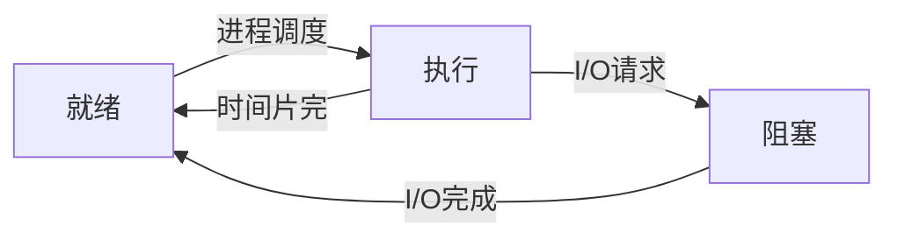

## 文件编程

两种方法：

- Linux系统调用，依赖于linux系统
- C语言库函数，各平台都可以进行

### 系统调用方式：

`int creat(const char *filename, mode_t mode)`创建一个文件

open打开一个文件，read，write，

lseek移动文件读写指针

access判断文件是否可读可写等

### 库函数方式：

fopen，fread，fwrite，fgetc

## 时间编程

时间类型：

- 格林威治时间（GMT）即世界标准时间
- 日历时间，即从一个标准时间点（如：1970年1月1日0点）到现在经过的秒数来表示的时间

### 时间获取

time_t time():获取日历时间

gmtime();将日历时间转化为格林威治时间，保存到TM结构体

localtime():将日历时间转化为本地时间，保存到TM结构体

```c
#include <stdio.h>
#include <time.h>

int main(void)
{
    struct tm *local;
    time_t t;
    t = time(NULL);
    local = localtime(&t);
    printf("local hour is: %d\n", local->tm_hour);
    local = gmtime(&t);
    printf("UTC hour is: %d\n", local->tm_hour);
    return 0;
}
```

输出：local hour is: 12
			UTC hour is: 4

## 进程

### 定义

进程是一个具有一定独立功能的程序的一次运行活动

### 进程和程序的区别

程序没运行的时候是一个文件，运行起来就成了一个进程

### 特点

- 动态性
- 并发性
- 独立性
- 异步性



### 进程ID

进程ID：标识进程的唯一数字(PID) --> 父进程ID（PPID）
													--> 启动进程的用户ID（UID）

### 进程互斥

若干进程都要使用某一共享资源时，任何时刻最多允许一个进程使用，其他要使用该资源的进程必须等待，知道该占用资源者释放了资源为止

### 临界资源

操作系统中将一次只允许一个进程访问的资源成为临界资源

### 临界区

进程中访问临界资源的**那段程序代码**成为临界区

### 进程同步

一组==并发的进程==按照==一定的顺序==执行过程成为进程的同步。具有同步关系的一组并发进程成为合作进程，合作进程间==相互发送的信号称为消息或事件==

### 进程调度

按照一定算法，从一组待运行的进程中选出来一个来占有CPU运行

调度方式：抢占式和非抢占式

调度算法

- 先来先服务调度算法
- 短进程优先调度算法
- 高优先级优先调度算法
- 时间片轮转发

死锁：多进程调度过程中无外力作用出现无法往下运行的状态

### 进程操作函数

getpid()	//获取本进程ID

getppid()	//获取父进程ID（进程运行中可创建子进程）

fork()	//创建子进程，返回一个进程号，为子进程

```c
#include <stdio.h>
#include <unistd.h>
int main(void)
{
    pid_t pid;
    int count = 0;
    pid = fork();
    count++;
    printf("count = %d\n", count);	//会输出两次count，都输出1
    return 0;
}
```

fork创建子进程后输出两次的count且都为1的原因：

创建子进程会拷贝父进程的数据空间、堆栈空间，而不是共享，但代码段共享，所以互相运行，互不影响

vfork()	//创建子进程，与fork区别在于：

- vfork子进程和父进程共享数据段
- vfork：子进程先运行，父进程后运行，而fork父子进程执行顺序不确定

exec()//     替换当前进程的代码和数据

wait()	//阻塞该进程，直到其某个子进程退出 

### 进程通信

待看

## 线程

### 线程优点

启动一个新进程必须给它独立的地址空间，建立众多的数据表来维护它的代码段、堆栈段和数据段，这是一种非常”昂贵“的多任务工作方式，而进程非常”节俭“，运行于一个进程中的多个线程，使用相同的地址空间，线程彼此切换所需的时间也远远小于进程间切换所需时间

### linux下多线程特点

Linux下多线程遵循POSIX线程接口，成为pthread，编写Linux下多线程程序，需使用头文件pthread.h，连接时需要使用库libpthread.a